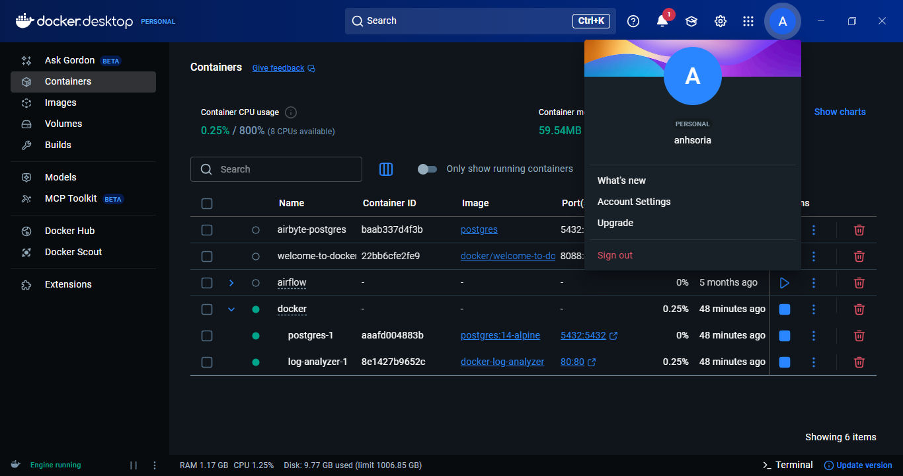
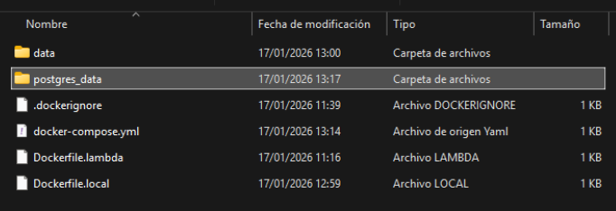
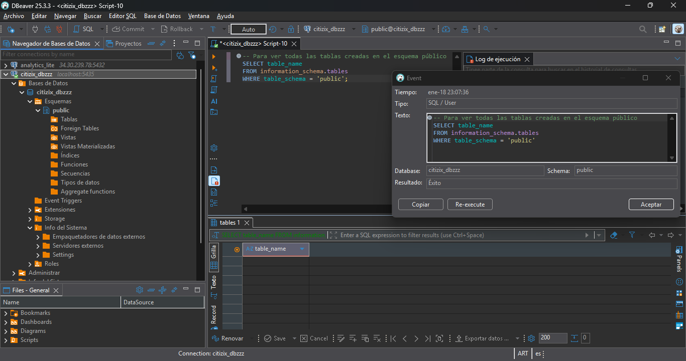

# 📂 Log Analyzer: Infraestructura & Contenerización

Realizado por: Alejandro Nelson Herrera Soria

LinkedIn: https://www.linkedin.com/in/alejandro-nelson-herrera-soria

Este repositorio contiene la implementación profesional del sistema de análisis de logs para  **Umbrella Corp**.
El enfoque principal fue transformar un script local en una solución productiva, portable y persistente utilizando **Docker** y  **AWS**.

## 🛠️ Stack Tecnológico

* **Lenguaje:** Python 3.11-slim
* **Base de Datos:** SQLite (Local) & PostgreSQL (Relacional)
* **Infraestructura:** Docker & Docker Compose
* **Cloud Registry:** Docker Hub & AWS ECR

---

## 🧠 Bitácora de Desafíos y Soluciones (The Engineering Process)

A continuación, documento los retos técnicos enfrentados durante el desarrollo y las decisiones arquitectónicas tomadas.

### 1. El Desafío de la Imagen Optimizada

* **Problema:** Necesidad de un entorno reproducible que no fuera pesado ni propenso a errores de dependencias.
* **Solución:** Se diseñó un `Dockerfile.local` basado en `python:3.11-slim`.
* **Por qué:** Se eligió la versión *slim* para reducir la superficie de ataque y el tiempo de despliegue (cold start), eliminando capas innecesarias pero manteniendo la robustez de Python 3.11.

### 2. La Paradoja de la Persistencia (SQLite & Volumes)

* **Problema:** Al ejecutar el contenedor, la aplicación fallaba con un `AssertionError` indicando que la base de datos no existía, a pesar de estar presente en el host.
* **Solución:** Corrección de la ruta del volumen en `docker-compose.yml` de `./data` a `../data`.
* **Decisión Técnica:** Al estar el orquestador en una subcarpeta (`/docker`), el contexto requería subir un nivel para mapear correctamente el volumen físico con el lógico en `/app/data`. Esto garantiza que los logs procesados no se pierdan al destruir el contenedor.

### 3. Orquestación Multi-Contenedor

* **Problema:** Necesidad de integrar el analizador de logs con una base de datos PostgreSQL manteniendo el aislamiento.
* **Solución:** Implementación de una red tipo `bridge` en Docker Compose.
* **El "Cómo":** Se configuraron servicios aislados que se comunican por nombres de DNS internos (`postgres`), permitiendo que la infraestructura sea escalable y fácil de migrar a entornos de producción.

---

## 📊 Matriz de Decisiones Arquitectónicas

| **Pregunta**     | **Decisión**     | **¿Por qué esta y no otra?**                                                                                    |
| ---------------------- | ----------------------- | ----------------------------------------------------------------------------------------------------------------------- |
| **¿Qué?**      | Docker Containerization | Porque elimina el problema "en mi máquina funciona" y estandariza el runtime.                                          |
| **¿Para qué?** | Volúmenes Proyectados  | Para persistir datos de SQLite en el host y permitir depuración en tiempo real.                                        |
| **¿Cómo?**     | Docker Compose          | Para evitar comandos CLI extensos y permitir que un tercero levante el sistema con un solo comando.                     |
| **¿Dónde?**    | Docker Hub vs ECR       | **Docker Hub**para visibilidad de portfolio público;**AWS ECR**para seguridad y despliegue privado en AWS. |

---

## 🎓 Skills Acquired & Technical Competencies

Durante el desarrollo de este proyecto, se han consolidado competencias clave de la ingeniería de datos tales como:

* **Arquitectura de Contenedores:** Diseño y construcción de imágenes optimizadas utilizando `Dockerfile` y gestión de entornos multi-contenedor con `Docker Compose`.
* **Gestión de Infraestructura de Datos:** Configuración de persistencia mediante volúmenes y orquestación de redes internas para la comunicación segura entre microservicios.
* **Resolución de Problemas de Red (Troubleshooting):** Implementación de re-mapeo de puertos dinámicos para evitar conflictos en entornos locales de desarrollo.
* **Interoperabilidad de Bases de Datos:** Manejo simultáneo de motores relacionales (PostgreSQL) y locales (SQLite), asegurando la integridad de los datos en sistemas efímeros.
* **Documentación de Ingeniería:** Elaboración de manuales técnicos y bitácoras de errores, fundamentales para el trabajo en equipos ágiles y entornos de producción.

## 📸 Evidencias Documentales (Capturas)

**Dashboard de Docker Desktop**: Se vean ambos contenedores (`log-analyzer` y `postgres`) en verde.
**Objetivo**: Mostrar la orquestación funcionando.



**Prueba de Persistencia:** La captura de mi explorador de archivos mostrando la carpeta `postgres_data` creada automáticamente en mi SO tras el `up`..
**Objetivo**: Muestra como Docker escribe en el disco físico.


### **DBeaver:**

**Conexión exitosa**: El mensaje de "Éxito" al ejecutar la consulta demuestra que el re-mapeo al puerto 5435 fue la solución definitiva para evitar conflictos con servicios locales.

**Observación de Ingeniero**: Notarás que el resultado de la consulta para ver las tablas está vacío. Esto es totalmente normal en este punto de la cursada, ya que tu script de Python está configurado para usar SQLite (logs.db) como almacenamiento primario. La base de datos Postgres está lista en la infraestructura para cuando decidas migrar los datos del entorno local al relacional.



---

## 🚀 Ejecución Rápida

Para replicar este entorno:

**Bash**

```
git clone https://github.com/AleHerreraSoria/Aplicaciones_basadas_en_contenedores_Docker.git
cd DockerBasedApps
docker-compose -f docker/docker-compose.yml up --build
```
